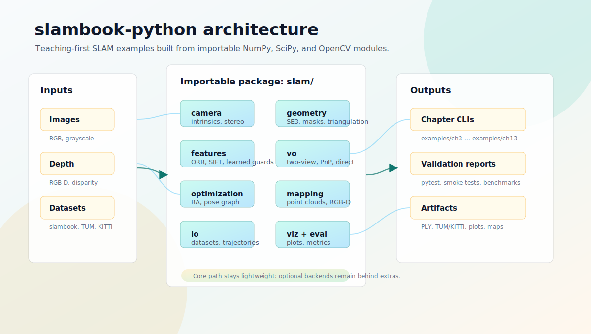

# slambook-python

Python implementations of selected projects and examples from
[slambook](https://github.com/gaoxiang12/slambook).


This repository contains a teaching-first Python package for the core slambook
concepts. The legacy root scripts remain in place while the migrated importable
modules and examples live under `slam/` and `examples/`.

## Beginner Path

If you are using this repo as a Python-first companion to slambook, start with
the core environment and the chapters that need no large datasets:

```bash
uv sync --extra core --extra test --frozen
uv run python -m pytest
uv run python examples/ch3_geometry/transforms.py
uv run python examples/ch4_lie/exp_log.py
uv run python examples/ch6_optimization/curve_fitting.py
uv run python examples/ch10_bundle_adjustment/scipy_bal.py \
  --bal examples/ch10_bundle_adjustment/tiny_bal.txt \
  --fix-cameras
uv run python examples/ch11_pose_graph/optimize_pose_graph.py \
  --g2o examples/ch11_pose_graph/tiny_pose_graph.g2o
```

Then add slambook sample images under `data/slambook/` and continue with the
camera, visual odometry, loop closure, and dense mapping examples listed below.
Large datasets are intentionally not committed; see `docs/datasets.md` for the
expected layouts.

For mainland China, sync the same environment with a uv mirror:

```bash
UV_DEFAULT_INDEX=https://pypi.tuna.tsinghua.edu.cn/simple uv sync --extra core --extra test --frozen
uv run python -m pytest
```

## Install

This repo documents the `uv` workflow only. Sync once for the dependency group
you need, then use `uv run ...` for normal commands.

Core educational dependencies:

```bash
uv sync --extra core --frozen
```

Core dependencies plus tests:

```bash
uv sync --extra core --extra test --frozen
uv run python -m pytest
```

In mainland China, a PyPI mirror can be used with the checked-in lockfile:

```bash
UV_DEFAULT_INDEX=https://pypi.tuna.tsinghua.edu.cn/simple uv sync --extra core --extra test --frozen
uv run python -m pytest
```

Optional dependency groups are defined for 3D/evaluation tools, modern matchers,
and reference backends:

```bash
uv sync --extra 3d --frozen
uv sync --extra modern --frozen
uv sync --extra backend --frozen
uv sync --all-extras --frozen
```

Importing `slam` does not require optional modern backends.

## Architecture



## Migration Status

See `docs/status.md` for the chapter-by-chapter status table.
See `docs/datasets.md` for expected local dataset layouts.
See `docs/validation.md` for the latest local validation notes.
See `docs/notes.md` for organized notes from the legacy scripts.
See `CONTEXT.md` for the migration glossary and notation conventions.

Representative migrated examples:

```bash
uv run python examples/ch7_feature_vo/pose_estimation_2d2d.py \
  --image0 data/slambook/ch7/1.png \
  --image1 data/slambook/ch7/2.png \
  --matcher orb

uv run python examples/ch10_bundle_adjustment/scipy_bal.py \
  --bal examples/ch10_bundle_adjustment/tiny_bal.txt \
  --fix-cameras

uv run python examples/ch13_dense_mapping/rgbd_fusion.py \
  --color-dir data/slambook/ch13/color \
  --depth-dir data/slambook/ch13/depth \
  --pose-file data/slambook/ch13/pose.txt \
  --intrinsics FX FY CX CY \
  --output outputs/ch13_cloud.ply
```

Validation and benchmark helpers live under `examples/reference/`:

```bash
uv run python examples/reference/validate_upstream_samples.py \
  --upstream-root data/slambook-upstream \
  --work-dir /tmp/slambook-python-validation

uv run python examples/reference/benchmark_report.py \
  pose-graph \
  --g2o examples/ch11_pose_graph/tiny_pose_graph.g2o \
  --solve \
  --output /tmp/slambook-python-validation/pose_graph_report.json
```

Optional backend integration checks are kept outside the default pytest path:

```bash
uv sync --all-extras --frozen
uv run python -m pytest tests_optional
```

With a uv mirror:

```bash
UV_DEFAULT_INDEX=https://pypi.tuna.tsinghua.edu.cn/simple uv sync --all-extras --frozen
uv run python -m pytest tests_optional
```

On macOS, FAISS and PyCOLMAP can load duplicate OpenMP runtimes in the same
pytest process. If Python aborts while importing optional native backends, run
the optional suite with:

```bash
KMP_DUPLICATE_LIB_OK=TRUE uv run python -m pytest tests_optional
```

## Legacy Scripts

The original root-level scripts are kept under `legacy/` as the historical
baseline during the migration:

- `legacy/pose_estimation_2d2d.py`
- `legacy/pose_estimation_3d2d.py`
- `legacy/flann_based_matcher.py`
- `legacy/ransac_test.py`
- `legacy/simStereoCamera.py`
- `legacy/testRefine.py`
- `legacy/utils.py`

New code should use importable modules under `slam/` and runnable examples under
`examples/`.
